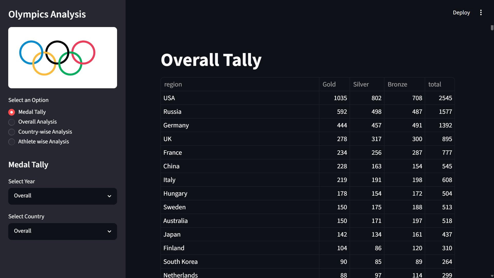
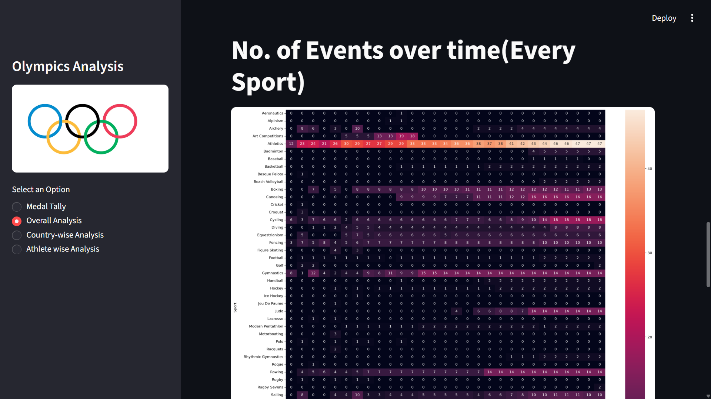
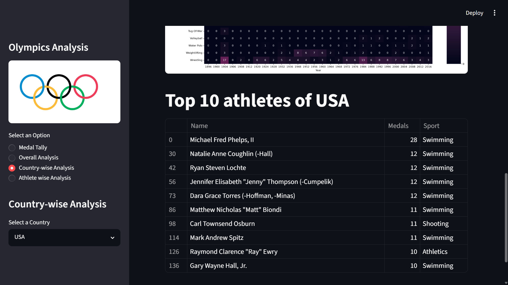
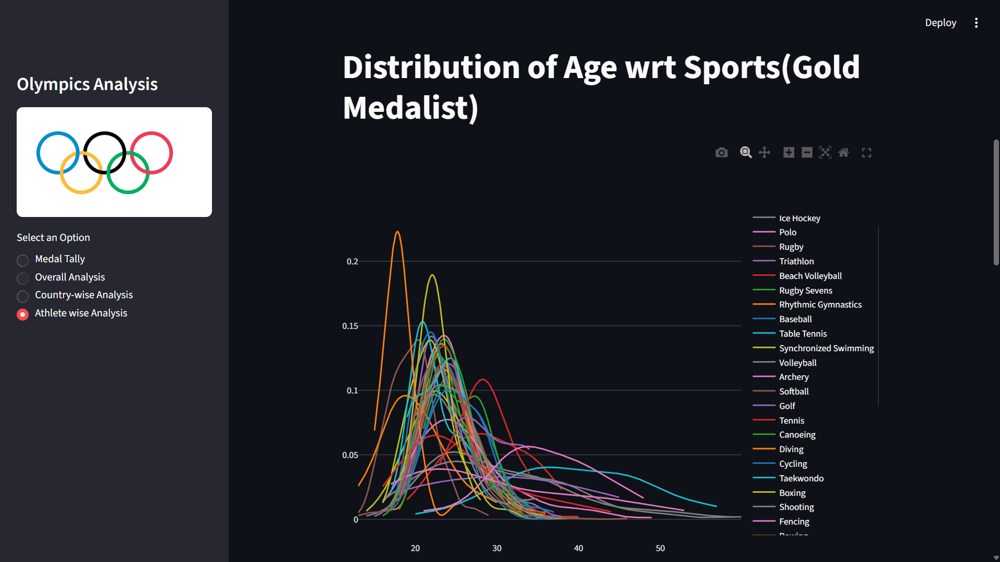
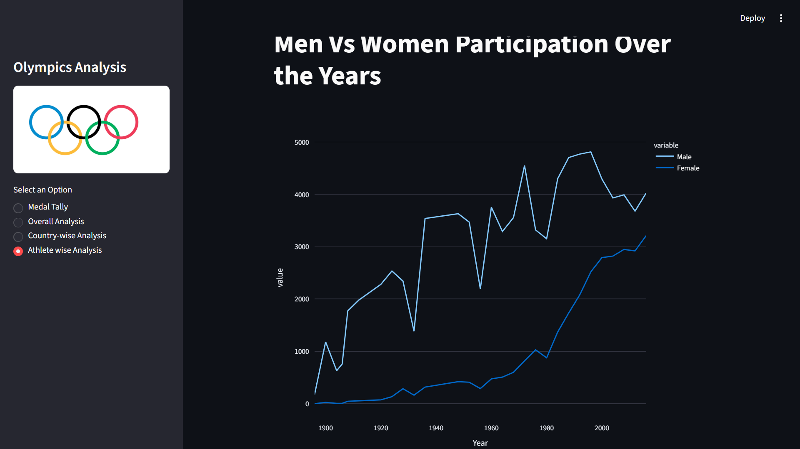
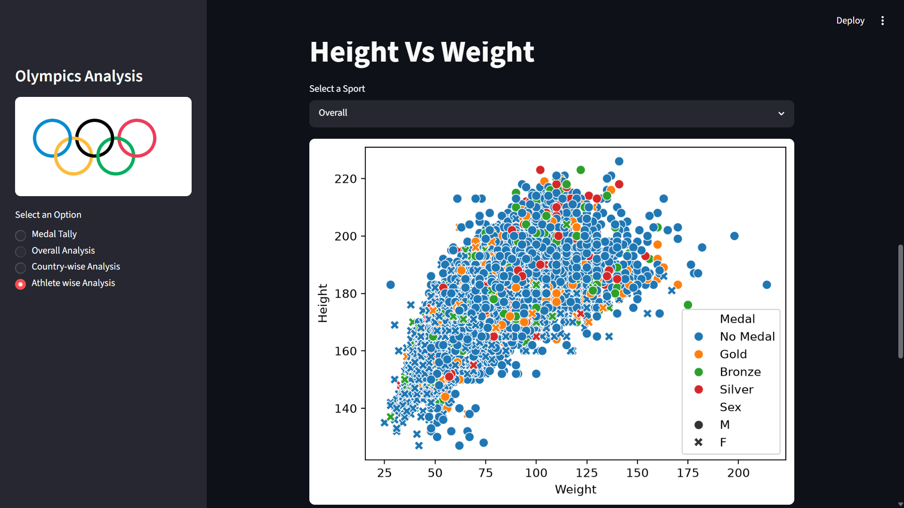

# 🏅 Olympics Data Analysis Web App

A Streamlit web application for interactive analysis and visualization of 120 years of Olympic history — covering athletes, results, and trends from Athens 1896 to Rio 2016.

📦 **Dataset:** [120 Years of Olympic History – Kaggle](https://www.kaggle.com/heesoo37/120-years-of-olympic-history-athletes-and-results)

---

## 📌 Overview

This app allows users to explore the Olympics dataset through an intuitive web interface. It provides insights into athlete demographics, country-wise medal tallies, sport-specific trends, and more — all through interactive charts and filters.

---

## 🚀 Features

- 🌍 **Medal Tally** – Filter and view medal counts by country and year
- 📈 **Overall Analysis** – Trends in participating nations, athletes, and events over time
- 👤 **Country-wise Analysis** – Deep dive into any country's Olympic performance
- 🏋️ **Athlete-wise Analysis** – Distribution of age, weight, height across sports and genders
- 🔍 **Interactive Filters** – Explore data by sport, year, season, and more

---

## 🛠️ Tech Stack

| Tool | Purpose |
|------|---------|
| [Python](https://www.python.org/) | Core language |
| [Streamlit](https://streamlit.io/) | Web app framework |
| [Pandas](https://pandas.pydata.org/) | Data manipulation |
| [Plotly](https://plotly.com/python/) | Interactive visualizations |
| [Matplotlib](https://matplotlib.org/) / [Seaborn](https://seaborn.pydata.org/) | Statistical plots |

---

## 📁 Project Structure

```
olympics-data-analysis-web-app/
│
├── app.py                  # Main Streamlit application
├── helper.py               # Helper functions for data processing
├── preprocessor.py         # Data preprocessing logic
│
├── athlete_events.csv      # Main dataset
├── noc_regions.csv         # NOC to region/country mapping
│
├── requirements.txt        # Python dependencies
└── README.md
```

---

## ⚙️ Installation & Setup

### 1. Clone the repository

```bash
git clone https://github.com/your-username/olympics-data-analysis-web-app.git
cd olympics-data-analysis-web-app
```

### 2. Create a virtual environment (recommended)

```bash
python -m venv venv
source venv/bin/activate       # On Windows: venv\Scripts\activate
```

### 3. Install dependencies

```bash
pip install -r requirements.txt
```

### 4. Download the dataset

Download the dataset from [Kaggle](https://www.kaggle.com/heesoo37/120-years-of-olympic-history-athletes-and-results) and place both CSV files in the project root:

- `athlete_events.csv`
- `noc_regions.csv`

### 5. Run the app

```bash
streamlit run app.py
```

The app will open in your browser at `http://localhost:8501`.

---

## 📊 Dataset Details

| File | Description |
|------|-------------|
| `athlete_events.csv` | 271,116 rows covering athletes, events, medals (1896–2016) |
| `noc_regions.csv` | Maps National Olympic Committee codes to countries/regions |

**Key columns:** `Name`, `Sex`, `Age`, `Height`, `Weight`, `Team`, `NOC`, `Games`, `Year`, `Season`, `City`, `Sport`, `Event`, `Medal`

---

## 📸 Screenshots









---

## 🤝 Contributing

Contributions are welcome! Feel free to open an issue or submit a pull request.

1. Fork the repo
2. Create a feature branch: `git checkout -b feature/your-feature`
3. Commit your changes: `git commit -m 'Add your feature'`
4. Push to the branch: `git push origin feature/your-feature`
5. Open a Pull Request

---

## 📄 License

This project is licensed under the [MIT License](LICENSE).

---

## 🙏 Acknowledgements

- Dataset by [rgriffin](https://www.kaggle.com/heesoo37) on Kaggle
- Built with ❤️ using [Streamlit](https://streamlit.io/)